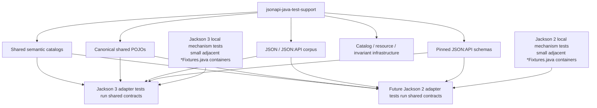

# jsonapi-java-test-support

Internal, unpublished module that owns the shared test-contract infrastructure consumed by Jackson 3
and future Jackson 2 suites: canonical shared models, semantic scenario catalogs, the JSON:API
corpus, and pinned JSON:API schema resources.

**Shared cross-adapter semantics are central; Jackson-major-specific mechanics stay local.**



Adapters execute the shared catalogs and classpath resources for parity. Mix-ins, naming strategies,
custom serializers, JavaType entry points, mapper isolation, and exact Jackson access counts stay
in each adapter suite. Adapter-major mechanism fixtures live in small capability-local containers
next to their owning specs; generic/global adapter `testmodel`, `models`, or `fixtures` package
collections are not part of this architecture.

## Fixture and test placement rules

These rules are the durable contributor/agent contract for where new tests and fixtures belong:

1. **Search shared canonical fixtures first.** Before adding any new model or carrier type,
   check whether a fixture family under `testsupport.fixtures..` or an existing catalog entry
   already expresses the needed shape; extend an existing family only when it stays coherent.
2. **Add shared models only for genuine cross-adapter semantic contracts.** A type belongs here
   when every Jackson-major adapter must prove the same wire-visible behavior through it. Do not
   promote a fixture merely because a future adapter will need an analogous mechanism test.
3. **Keep Jackson-major-specific fixtures local** to the owning spec/capability in the adapter
   module: mix-ins, naming strategies, custom serializers/deserializers, creator/introspection
   edges, `JavaType` entry points, mapper/module isolation, parser/stream mechanics, feature
   toggles, version-specific causes, and construction mechanics.
4. **Do not create new generic/global adapter test-model packages.** No new `testmodel`,
   `models`, or catch-all adapter fixture packages.
5. **Prefer small capability-local `*Fixtures.java` containers** with static nested classes over
   many standalone one-off DTO files; keep standalone adjacent files only when Java/Jackson
   semantics or readability genuinely favor them. A fixture's owner should be obvious from where
   it lives.
6. **Do not add tests solely to exercise inert fixture accessors** for coverage percentages.
   Fixture carriers are coverage-exempt by placement; tests must protect behavior.
7. **Shared wire-semantic JSON belongs in the central corpus**, loaded through
   `TestSupportResources` — not in long inline strings duplicated across suites. Short inline
   payloads inside focused mechanism probes remain fine.
8. **Generic `FixtureCatalog` behavior is tested once** in `FixtureCatalogSpec` (duplicate ids,
   registration order, `byId`, unknown-id area labels, `where`, immutability). Feature
   `*ScenariosCatalogSpec` classes own feature-specific catalog integrity, not a second copy of
   the catalog implementation.

If Jackson 2 must prove the same behavior with the same application-shaped model and expected
JSON:API semantics, that contract belongs in this module. Jackson-major serializers,
deserializers, annotations, introspection, naming, `JavaType`, and mapper behavior stay
adapter-local.

## Packages

Executable support code (catalogs, scenario descriptors, resource loading, invariants) lives in
feature packages; passive application-shaped carriers live only under `testsupport.fixtures..`.

| Package                                                        | Role                                                               |
|----------------------------------------------------------------|--------------------------------------------------------------------|
| `io.github.kazemek.jsonapi.testsupport`                        | `Scenario` / `FixtureCatalog` contract and `TestSupportResources` |
| `io.github.kazemek.jsonapi.testsupport.codec`                  | `CodecScenario` capability metadata, `CodecScenarios` catalog, `AmbiguousPrimaryDataScenarios`, JSON-P-backed `NegativeCodecScenarios`, `SchemaKind` / `SchemaDisagreement` |
| `io.github.kazemek.jsonapi.testsupport.domainwrite`            | `DomainWriteScenarios` catalog plus the `DomainWriteOperation` / `DomainWriteInput` / `DomainWriteOutcome` / `DomainWriteComparisonPolicy` value types, `DomainWriteVerifier`, and the `WriteDiagnosticsScenarios` semantic failure catalog with `WriteDiagnosticScenario` |
| `io.github.kazemek.jsonapi.testsupport.domainread`             | `DomainReadScenarios` catalog plus the `DomainReadInput` / `ConverterBehavior` / `DomainReadExpectation` value types and `DomainReadVerifier` |
| `io.github.kazemek.jsonapi.testsupport.compoundwrite`          | `CompoundWriteScenarios` catalog plus the `CompoundWriteRequest` / `CompoundWriteExpectation` / `CompoundWriteSide` value types |
| `io.github.kazemek.jsonapi.testsupport.sparsefieldset`         | `SparseFieldsetScenarios` catalog plus the `SparseFieldsetOperation` / `SparseFieldsetRequest` / `SparseFieldsetExpectation` value types and `FieldsetResourceState.assertMatches` |
| `io.github.kazemek.jsonapi.testsupport.enveloperead`           | `EnvelopeReadScenarios` catalog plus the `EnvelopeReadVariant` / `EnvelopeReadInput` / `EnvelopeReadExpectation` value types |
| `io.github.kazemek.jsonapi.testsupport.domainpatch`            | Presence-aware PATCH (`PatchScenarios` + `PatchScenario` / `PatchExpectation` + `PatchVerifier`) and direct typed PATCH DTO (`PatchDtoScenarios` + `PatchDtoScenario` / `PatchDtoExpectation` + `PatchDtoVerifier`) catalogs |
| `io.github.kazemek.jsonapi.testsupport.fixtures.*`             | **Passive carriers only**, grouped by feature (`domainread`, `domainwrite`, `domainpatch`, `compoundwrite`, `sparsefieldset`, `enveloperead`): annotated records/beans, structured values, presence-wrapper shapes, instrumented access-counting models, and intentionally invalid declaration targets. No catalogs, loaders, descriptors, or invariant logic may live here — ArchUnit enforces this structurally. |

Canonical carrier families kept deliberately small: the domain-write graph (`Article` /
`Person` / `Comment`), the ordinary flat-read family around `FlatArticle`, supported
`RelationshipLinkage` container shapes (`array` / `Set` / `Optional` / `Map` identifier meta),
the typed PATCH family around `ArticlePatch` with compact structured values (`Address`, `Geo`,
containers), the compact `ArticleMeta` / `AuthorMeta` / `AuthorIdMeta` / `CommentIdMeta` meta
family plus whole-meta declaration targets, and intentional mutable JavaBean shapes
(`FlatMutableArticle`, `MutableAddress` / `MutableAddressPatch`) where bean semantics are part of
the contract.

## Minimal usage

This module is not published and its types are not a supported production/library API. Each
feature catalog class exposes exactly one accessor, `catalog()`, returning an immutable
`FixtureCatalog` view; that is the canonical retrieval path. Capability selection is `where`
with the descriptor predicates:

```groovy
CodecScenarios.catalog().where(CodecScenario::readable)
CodecScenarios.catalog().where(CodecScenario::writable)
CodecScenarios.catalog().where { it.schemaKind() != null }
NegativeCodecScenarios.catalog().all()
AmbiguousPrimaryDataScenarios.catalog().all()
DomainWriteScenarios.catalog().all()
DomainWriteScenarios.catalog().byId("maps mutable POJO")
DomainReadScenarios.catalog().all()
DomainReadScenarios.catalog().byId("binds mutable POJO")
CompoundWriteScenarios.catalog().all()
CompoundWriteScenarios.catalog().byId("includes nested intermediates for comments.author")
SparseFieldsetScenarios.catalog().all()
SparseFieldsetScenarios.catalog().byId("attribute-only fieldset via toMappedDocument")
EnvelopeReadScenarios.catalog().all()
EnvelopeReadScenarios.catalog().byId("binds a single-resource document into a flat DTO envelope")
PatchScenarios.catalog().all()
PatchScenarios.catalog().byId("patch-omitted-and-supplied-attributes")
PatchDtoScenarios.catalog().all()
PatchDtoScenarios.catalog().byId("patch-dto-omitted-and-supplied-attributes")
TestSupportResources.readCorpusUtf8("documents/single-resource.json")
TestSupportResources.readCorpusBytes("documents/member-order.compact.json")
TestSupportResources.readCorpusUtf8("patch/address-street-and-geo-lat.json")
TestSupportResources.readSchemaUtf8("schema.json")
```

Shared JSON lives on this module's classpath (`jsonapi/corpus/1.1/` and vendored
`jsonapi/schema/vendor/1.1-pr1603/`). Load it through `TestSupportResources`; do not resolve
repository-root paths or JVM system properties.

## Non-goals

This module does not add wire expectations, diagnostics, or corpora per Jackson major — those
must stay version-neutral (see [ADR-007](../docs/adr/007-module-boundaries.md)). The flat write,
flat read, compound-write, sparse-fieldset, typed-envelope, presence-aware PATCH, and direct typed
PATCH DTO catalogs are in this module.

## Further reading

- [Architecture overview](../docs/architecture.md)
- [JSON:API 1.1 corpus](src/main/resources/jsonapi/corpus/1.1/README.md)
- [Pinned JSON:API schemas](src/main/resources/jsonapi/schema/vendor/1.1-pr1603/README.md)
- [Conformance checklist](../docs/conformance.md)
- [ADR-009 — JSpecify nullness](../docs/adr/009-jspecify-nullness.md)
- [ADR-010 — Architectural tests](../docs/adr/010-architectural-tests.md)
- [ADR-011 — Flat DTO reads](../docs/adr/011-flat-dto-read-binding.md)
- [Root agent workflow](../AGENTS.md)

## For contributors / agents

- **Retrieval:** each `*Scenarios` class owns exactly one immutable `FixtureCatalog` and exposes it
  through a single static `catalog()` accessor; that accessor plus `all()` / `byId(String)` /
  `where(Predicate)` on the returned catalog is the canonical retrieval surface. Future catalogs
  follow the same shape and do not invent retrieval types or facade classes.
- **Stable ids and paths:** `CodecScenario` ids and expected JSON paths are stable across Jackson
  majors; never fork or rewrite expected wire documents for new terminology. `manifest.json`
  remains the ordered index and `CodecScenariosCatalogSpec` enforces the bijection.
  `DomainWriteScenarios` ids are stable and looked up via `byId(String)`; the catalog grows by
  addition.   `DomainReadScenarios` ids are likewise stable; binder suites dispatch on
  `DomainReadInput` / `ConverterBehavior`, never on scenario ids. `CompoundWriteScenarios` ids are
  stable; adapter suites dispatch on `CompoundWriteRequest`, never on scenario ids.
  `SparseFieldsetScenarios` ids are stable; adapter suites dispatch on
  `SparseFieldsetOperation` / `SparseFieldsetRequest`, never on scenario ids.
  `EnvelopeReadScenarios` ids are stable; adapter suites dispatch on `EnvelopeReadVariant` /
  `EnvelopeReadExpectation`, never on scenario ids. `PatchScenarios` ids are stable; adapter
  suites dispatch on `PatchExpectation`, never on scenario ids.
- **Domain-write catalog:** `DomainWriteScenariosCatalogSpec` enforces the local invariants that
  hold for every entry regardless of catalog size: exactly one
  operation/typed input/envelope state/discriminated outcome/comparison policy, complete expected
  outcomes, and valid policies (entries reference existing relationships; unordered comparison
  only for to-many linkage). Duplicate ids and generic catalog behavior belong to
  `FixtureCatalogSpec`. Adapter suites iterate the whole catalog directly
  (`catalog().all()`) through their own mapper, so adding a scenario is a one-step action: add it
  to the catalog and the adapter suites pick it up automatically. Adapter-specific behavior (Jackson API surface, mapper-factory wiring) is
  documented in the adapter-local specs themselves, not enumerated in a manifest. Semantic
  comparison lives in `DomainWriteVerifier` so Jackson 2 does not copy resource/document
  comparison. Identifier-meta containers, whole-meta declarations, Optional/array relationship
  shapes, and inherited JavaBean properties that every Jackson major must prove identically
  belong here, not in adapter-local specs.
- **Domain-read catalog:** `DomainReadScenariosCatalogSpec` enforces the local invariants that
  hold for every entry regardless of catalog size: exactly one input
  variant/converter-behavior discriminator/discriminated expectation, resolvable target DTO
  classes in the shared `domainread`/`domainwrite`/`domainpatch` packages, and either a complete bound value
  or a known diagnostic (`propertyPath` only when the shared catalog asserts it; expected
  `propertyPath` values are resource-relative JSON Pointer text per the adapter mapping-location
  contract, or null when the catalog pins no location). Adapter suites
  iterate the whole catalog directly (`catalog().all()`) through their own binder. Binder
  expectations are resource-relative and
  never read `included` (ADR-011). Jackson-derived property-name paths and major-specific cause
  types stay in adapter-local supplementary assertions. Adapter-specific behavior (custom
  deserializers, naming strategies, mix-ins, `JavaType` entry points, linkage mappers) is
  documented in the adapter-local specs themselves, not enumerated in a manifest. Semantic
  comparison lives in `DomainReadVerifier`; adapter suites keep only Jackson-derived cause
  details locally.
- **Compound-write catalog:** `CompoundWriteScenariosCatalogSpec` enforces the local invariants that
  hold for every entry regardless of catalog size: exactly one request
  variant/discriminated expectation, resolvable included identities or known diagnostics, and the
  absent-`included` versus present-empty-array distinction. Adapter suites iterate the whole
  catalog directly (`catalog().all()`) through their own mapper. Canonical codec compound documents do not replace
  these domain-graph traversal proofs. Adapter-specific behavior (absolute getter-read counts,
  round-trip serialization) is documented in the adapter-local specs themselves, not enumerated
  in a manifest.
- **Sparse-fieldset catalog:** `SparseFieldsetScenariosCatalogSpec` enforces the local invariants
  that hold for every entry regardless of catalog size: exactly one
  operation/request variant/discriminated expectation, resolvable resource states or known
  diagnostics, and the absent-`included` versus present-list distinction. The mapped-success
  expectation pins whether the mapping yields sparse-fieldset linkage-exemption provenance.
  Adapter suites iterate the whole catalog directly (`catalog().all()`) through their own mapper.
  `FieldsetResourceState.assertMatches` is the shared mapped-resource comparison so Jackson 2
  does not copy fieldset identity/attribute/relationship/meta assertions. Exact single-read access counts, fieldset-map
  and `FieldAllowance` mutation isolation, duplicate-name collapse, and writer-owned provenance
  composition/validation stay in adapter-local specs, not enumerated in a manifest.
- **Envelope-read catalog:** `EnvelopeReadScenariosCatalogSpec` enforces the local invariants that
  hold for every entry regardless of catalog size: resolvable codec scenario ids
  and named `envelope-binding/` documents, the per-variant field invariants (document-binding
  variants require `entryPoint` and `readerContext`; registry variants omit both), and either
  complete envelope values (including absent versus present-empty `included`) or a known mapping
  diagnostic joined to the document pointer. Adapter suites iterate the whole catalog directly
  (`catalog().all()`) through their own domain document reader. Included resources bind independently and are
  never injected into relationships (ADR-011). Adapter-specific behavior (`metaAs`, `JavaType`
  registrations, mapper-instance reader factories, custom linkage mappers, caller-owned streams,
  malformed input, validation failures) is documented in the adapter-local specs themselves, not
  enumerated in a manifest.
- **PATCH catalog:** `PatchScenariosCatalogSpec` enforces the local invariants that hold for every
  entry regardless of catalog size: unique stable ids, exactly one JSON document and discriminated
  `PatchExpectation`, and resolvable target DTOs in `domainread` / `domainwrite` / `domainpatch`.
  Adapter suites iterate the whole catalog directly (`catalog().all()`) through their own patch
  reader. Semantic comparison, including array-valued `PatchChange` members, lives in
  `PatchVerifier`. Adapter-local cases (custom deserializers,
  linkage mappers, Optional attribute null, `fromDocument` missing id, naming strategies, nested
  wrapper customization, shape-translated construction-failure pointers) stay in adapter specs only.
- **Typed PATCH DTO catalog:** `PatchDtoScenariosCatalogSpec` enforces the local invariants that
  hold for every entry regardless of catalog size: unique stable ids, exactly one JSON document
  and discriminated `PatchDtoExpectation`, resolvable PATCH DTOs in `domainpatch` (including the
  declaration-invalid fixtures), at least one `Success` / `ReaderFailure` / `BinderFailure` and at
  least one declaration-validation scenario, and `PatchPresence` values on every `Success`
  member. Adapter suites iterate the whole catalog directly (`catalog().all()`) through their own
  `patchDtoReader`. Adapter-local cases (generics/`JavaType`, wrapper-level `@JsonDeserialize` /
  `@JsonSerialize` rejection, naming strategies, `fromDocument`, custom linkage mappers,
  `NON_ABSENT`/`NON_EMPTY` robustness) stay in adapter specs only.
- **Structured PATCH coverage (ADR-014):** the catalogs grow by addition with nested structured
  scenarios — typed nested partial / empty / explicit-null / multi-level / `Optional` / container /
  non-object-wire / unknown-member / invalid-declaration (mixed, raw, direct-`Present`) / lazy
  validation cases, and low-level ordinary-domain (record, JavaBean-style, `Optional`-wrapped,
  nested-`Optional`, unknown-skip, nested-primitive-null, container-atomic, `PatchPresence`-wrapped
  scalar/ordinary, `PatchPresence`-wrapped-presence-aware-rejected) cases. The matrix is not
  record-only: JavaBean-style typed PATCH shapes and non-record low-level domain beans are covered
  to prove the semantics are ordinary Jackson-bean semantics, not record-specific introspection.
- **Write diagnostics:** `WriteDiagnosticsScenarios` is the curated cross-major contract for
  resource-write failures: each entry supplies a mis-declared carrier plus the expected
  major-neutral `MappingDiagnostic` category and either the stable wire location
  (resource-relative JSON Pointer) or an absent location for class-level failures. Adapter suites
  run the whole catalog through their own writer and assert full-catalog coverage.
  Jackson-specific cause chains and introspection mechanics stay adapter-local.
- **Capability selection:** Tests select by `FixtureCatalog.where` (and the retained
  `CodecScenarios` conveniences `writable`, `readable`, `schemaChecked`, `exactUtf8`,
  `hreflangArray`) instead of maintaining independent hard-coded id lists. Adapter write suites
  dispatch on the `DomainWriteOperation`/`DomainWriteInput` descriptor, never on scenario ids.
  Adapter binder suites dispatch on the `DomainReadInput`/`ConverterBehavior` descriptor, never
  on scenario ids. Adapter compound-write suites dispatch on `CompoundWriteRequest`, never on
  scenario ids. Adapter sparse-fieldset suites dispatch on
  `SparseFieldsetOperation`/`SparseFieldsetRequest`, never on scenario ids. Adapter envelope-read
  suites dispatch on `EnvelopeReadVariant` / `EnvelopeReadExpectation`, never on scenario ids.
  Adapter PATCH suites dispatch on `PatchExpectation`, never on scenario ids.
- **Resources:** Read corpus and vendored schema files only through `TestSupportResources`. Exact
  UTF-8 bytes are `readCorpusBytes` / `readSchemaBytes`. Schema pin/integrity lives in this
  module; adapter output-versus-schema execution stays in each Jackson-major suite.
- **Coverage:** Coverage is on by default. Only passive application-shaped carriers under
  `testsupport.fixtures..` are coverage-exempt: JaCoCo floor verification and Sonar `new_coverage`
  cover every other production class in this module automatically, with no per-class allowlist to
  maintain. A new executable support class is coverage-gated by placement; moving code under
  `fixtures` cannot hide logic from coverage because ArchUnit forbids executable-support
  dependencies inside that hierarchy (see `TestSupportDependencyRulesSpec`). Production-module
  floors are unchanged.
- **Passive carriers:** types under `testsupport.fixtures..` may contain the ordinary structure
  needed to exercise mapping semantics — annotations, records/classes, constructors, fields,
  accessors and mutators, simple value equality, and application-shaped instrumentation such as
  access counters or intentionally throwing creators — but never scenario catalogs, resource
  loading, validation/invariant logic, or other executable support infrastructure.
- **Negative corpus:** `NegativeCodecScenarios` loads `negative-manifest.json` with JSON-P (Jakarta
  JSON Processing + Parsson); the closed case set is enforced by `NegativeCodecScenariosCatalogSpec`.
  Category and rule-code values are manifest strings; adapters map them onto their own enums.
  Catalog specs still cross-check the manifest independently via `JsonSlurper`.
- **Ambiguous primary data:** `AmbiguousPrimaryDataScenarios` holds both expected models per
  scenario; these are valid dual-success documents, never failure fixtures.
- **Major-neutral boundary:** production types under `io.github.kazemek.jsonapi.testsupport..`
  never depend on `tools.jackson..`, `com.fasterxml.jackson.databind..`, a major-specific adapter
  package, `core.internal..`, or Groovy; `TestSupportDependencyRulesSpec` (ArchUnit, per ADR-010)
  enforces this on main bytecode — do not replace it with a source-import scan. JSON-P
  (`jakarta.json..` / `org.eclipse.parsson..`) is allowed for the negative-manifest loader.
- **Null-bearing write models:** `Article.author`, `Comment.author`, `Person.name`,
  `Comment.body`, and `SamplePojo.{id, name, comments}` are `@Nullable` under the `@NullMarked`
  `domainwrite` package (ADR-009); expected outcomes still hold non-null core values unless the
  scenario exercises an explicit null state.
- **Null-bearing read models:** omitted and explicit-null DTO members such as
  `FlatArticle.{title, body, author, comments}`, `FlatLidArticle.id`, and the mutable-field
  POJOs (`FlatMutableArticle`, `FlatDefaultedArticle`, `FlatThingWithIgnored`, and others) are
  `@Nullable` under the `@NullMarked` `domainread` package (ADR-009).
- **Null-bearing compound-write models:** `LinkedArticle.related`, `DeepNode.child`,
  `CyclicNode.child`, and `BaseComment.{id, body, author}` are `@Nullable` under the `@NullMarked`
  `compoundwrite` package (ADR-009). `CompoundWriteExpectation.Success.included` is `@Nullable` so
  absent `included` stays distinct from a present empty array.
- **Null-bearing sparse-fieldset expectations:** absent attributes/relationships, absent
  `included`, and `FIELDSETS_REQUIRE_MAPPED_DOCUMENT` `resourceClass`/`propertyPath` are
  `@Nullable` under the `@NullMarked` `sparsefieldset` package (ADR-009).
- **Null-bearing envelope-read models:** `FlatNode.parent` and `FlatThrowingArticle.title` are
  `@Nullable` under the `@NullMarked` `enveloperead` package (ADR-009).
  `EnvelopeReadExpectation.BoundEnvelope` uses Java `null` for absent envelope members and a
  non-null empty `IncludedExpectation` for present-empty `included`.
- **Null-bearing PATCH fixtures (ADR-014):** the JavaBean-style mutable fixtures
  (`MutableAddressPatch`, `MutableAddress`, `MutableArticle`, `MutableArticleWithAddressPatch`) are
  `@Nullable` on their fields and getters under the `@NullMarked` `domainpatch` package because the
  no-arg constructors leave them unbound until Jackson property binding runs (ADR-009).
- **Nullness:** Production packages are `@NullMarked` (JSpecify). Use `@Nullable` for catalog
  members that are absent (`CodecScenario.primaryDataKind`, `schemaKind`, `schemaDisagreement`,
  `exactUtf8Path`; `NegativeCodecScenario.pointer`, `ruleCode`;
  `DomainReadExpectation.Failure.propertyPath` / `resourceClass`;
  `CompoundWriteExpectation.Success.included` / `offPathRelationship` / `expectedTraversalDelta`;
  `CompoundWriteExpectation.Failure.propertyPath` / `resourceClass`;
  `SparseFieldsetExpectation.MappedSuccess.included` / `zeroReads`;
  `SparseFieldsetExpectation.UnmappedSuccess.included`;
  `SparseFieldsetExpectation.Failure.propertyPath` / `resourceClass`;
  `FieldsetResourceState.id` / `attributeNames` / `relationshipNames` / `meta`;
  `EnvelopeReadExpectation.BoundEnvelope` members that are absent (`data`, `included`, `errors`,
  `jsonapi`, `links`, `meta`); `EnvelopeReadExpectation.Failure.propertyPath` / `resourceClass`;
  `EnvelopeReadVariant.RegistryAttempt.propertyPath`; `PatchScenario.expectedEndpointIdentity`;
  `PatchChange` / attribute and relationship change `value`). Groovy tests are not annotated.
- **Extension workflow (Jackson 2):** a new adapter suite iterates every scenario of the shared
  domain-write catalog (`catalog().all()`) through its own resource mapper exactly like the
  Jackson 3 suite; the same direct full-catalog iteration applies to the domain-read binder
  catalog, the compound-write catalog, the sparse-fieldset catalog, the typed-envelope catalog,
  the presence-aware PATCH catalog, and the typed PATCH DTO catalog. No runner-side completeness
  bookkeeping is required: the catalog integrity specs own stable ids and invariants, and a new
  scenario reaches every adapter automatically. Adapter suites invoke shared semantic verifiers
  (`DomainWriteVerifier`, `DomainReadVerifier`, `PatchVerifier`, `PatchDtoVerifier`, `FieldsetResourceState.assertMatches`)
  rather than copying document/resource comparison. Jackson-API-specific behavior (mix-ins,
  serializers, naming strategies, converter wiring, custom deserializers, linkage mappers) stays
  in adapter-local specs with local fixtures, documented there.
