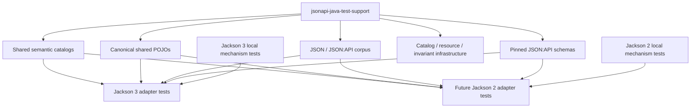

# jsonapi-java-test-support

Internal, unpublished module that owns the shared test-contract infrastructure consumed by Jackson 3
and future Jackson 2 suites: canonical shared models, semantic scenario catalogs, the JSON:API
corpus, and pinned JSON:API schema resources.

**Shared cross-adapter semantics are central; Jackson-major-specific mechanics stay local.**



Adapters execute the shared catalogs and classpath resources for parity. Mix-ins, naming strategies,
custom serializers, JavaType entry points, mapper isolation, and exact Jackson access counts stay
in each adapter suite. Fixture/model consolidation and Jackson 3 local-layout cleanup are follow-on
work, not this module's ownership contract.

## Packages

| Package                                                        | Role                                                               |
|----------------------------------------------------------------|--------------------------------------------------------------------|
| `io.github.kazemek.jsonapi.testfixtures`                       | `Scenario` / `FixtureCatalog` contract, `JsonApiFixtures` facade, and `TestSupportResources` |
| `io.github.kazemek.jsonapi.testfixtures.codec`                 | `CodecScenario` capability metadata, `CodecScenarios` catalog, `AmbiguousPrimaryDataScenarios`, JSON-P-backed `NegativeCodecScenarios`, `SchemaKind` / `SchemaDisagreement` |
| `io.github.kazemek.jsonapi.testfixtures.codec.cases`           | One scenario builder class per corpus entry (explicit list; no classpath scanning) |
| `io.github.kazemek.jsonapi.testfixtures.domainwrite`           | Shared flat domain-to-resource write fixtures: annotated domain models plus the `DomainWriteScenarios` catalog and the `DomainWriteOperation` / `DomainWriteInput` / `DomainWriteOutcome` / `DomainWriteComparisonPolicy` value types |
| `io.github.kazemek.jsonapi.testfixtures.domainread`            | Shared flat resource-to-DTO read fixtures: annotated DTO models plus the `DomainReadScenarios` catalog and the `DomainReadInput` / `ConverterBehavior` / `DomainReadExpectation` value types |
| `io.github.kazemek.jsonapi.testfixtures.compoundwrite`         | Shared compound-inclusion write fixtures: graph builders plus the `CompoundWriteScenarios` catalog and the `CompoundWriteRequest` / `CompoundWriteExpectation` / `CompoundWriteSide` value types |
| `io.github.kazemek.jsonapi.testfixtures.sparsefieldset`        | Shared sparse-fieldset write fixtures: annotated models plus the `SparseFieldsetScenarios` catalog and the `SparseFieldsetOperation` / `SparseFieldsetRequest` / `SparseFieldsetExpectation` value types |
| `io.github.kazemek.jsonapi.testfixtures.enveloperead`          | Shared typed-envelope read fixtures: envelope-only binding targets plus the `EnvelopeReadScenarios` catalog and the `EnvelopeReadVariant` / `EnvelopeReadInput` / `EnvelopeReadExpectation` value types |
| `io.github.kazemek.jsonapi.testfixtures.domainpatch`           | Shared presence-aware PATCH fixtures: `PatchScenarios` catalog plus `PatchScenario` / `PatchExpectation` value types (reuses `domainread` / `domainwrite` DTOs), and the direct typed PATCH DTO `PatchDtoScenarios` catalog plus `PatchDtoScenario` / `PatchDtoExpectation` and the shared `ArticlePatch` / `OptionalPatch` / `IntIdPatch` PATCH DTOs (including declaration-invalid PATCH DTOs). Recursive structured value fixtures (ADR-014): presence-aware nested PATCH shapes (`AddressPatch`, `GeoPatch`, `AddressWithGeoPatch`, `AddressWithOptionalCityPatch`, `AddressWithTagsPatch`, JavaBean-style `MutableAddressPatch`), their top-level DTOs, invalid nested declarations (`MixedAddressPatch`, `RawPresenceAddressPatch`, `DirectPresentAddressPatch`), and ordinary structured domain types for the low-level path (`Address`, `Geo`, `AddressWithGeo`, `AddressWithOptionalCity`, `Dimensions`, JavaBean-style `MutableAddress`, plus the low-level DTOs `Article`, `ArticleWithOptionalAddress`, `ArticleWithOptionalCity`, `ArticleWithGeoAddress`, `ArticleWithDimensions`, `ArticleWithTags`, `MutableArticle`, and the `PatchPresence<T>`-wrapped low-level DTOs `PatchPresenceTitleArticle`, `PatchPresenceAddressArticle`, `PatchPresenceAddressPatchArticle`) |

## Minimal usage

This module is not published and its types are not a supported production/library API, but
`JsonApiFixtures` is the canonical in-repo retrieval entry point (`FixtureCatalog` views; capability
selection is `where`). Concrete `*Scenarios` statics remain as compatibility shims:

```groovy
JsonApiFixtures.codec().where(CodecScenario::readable)
JsonApiFixtures.codec().where(CodecScenario::writable)
JsonApiFixtures.codec().where { it.schemaKind() != null }
JsonApiFixtures.negativeCodec().all()
JsonApiFixtures.ambiguousPrimaryData().all()
JsonApiFixtures.domainWrite().all()
JsonApiFixtures.domainWrite().byId("maps mutable POJO")
JsonApiFixtures.domainRead().all()
JsonApiFixtures.domainRead().byId("binds mutable POJO")
JsonApiFixtures.compoundWrite().all()
JsonApiFixtures.compoundWrite().byId("includes nested intermediates for comments.author")
JsonApiFixtures.sparseFieldset().all()
JsonApiFixtures.sparseFieldset().byId("attribute-only fieldset via toMappedDocument")
JsonApiFixtures.envelopeRead().all()
JsonApiFixtures.envelopeRead().byId("binds a single-resource document into a flat DTO envelope")
JsonApiFixtures.patch().all()
JsonApiFixtures.patch().byId("patch-omitted-and-supplied-attributes")
JsonApiFixtures.patchDto().all()
JsonApiFixtures.patchDto().byId("patch-dto-omitted-and-supplied-attributes")
TestSupportResources.readCorpusUtf8("documents/single-resource.json")
TestSupportResources.readCorpusBytes("documents/member-order.compact.json")
TestSupportResources.readSchemaUtf8("schema.json")
```

Shared JSON lives on this module's classpath (`jsonapi/corpus/1.1/` and vendored
`jsonapi/schema/vendor/1.1-pr1603/`). Load it through `TestSupportResources`; do not resolve
repository-root paths or JVM system properties.

## Non-goals

This module does not add wire expectations, diagnostics, or corpora per Jackson major — those
must stay version-neutral (see [ADR-007](../docs/adr/007-module-boundaries.md)). The flat write,
flat read, compound-write, sparse-fieldset, typed-envelope, presence-aware PATCH, and direct typed
PATCH DTO catalogs are in this module.

## Further reading

- [JSON:API 1.1 corpus](src/main/resources/jsonapi/corpus/1.1/README.md)
- [Pinned JSON:API schemas](src/main/resources/jsonapi/schema/vendor/1.1-pr1603/README.md)
- [Conformance checklist](../docs/conformance.md)
- [ADR-009 — JSpecify nullness](../docs/adr/009-jspecify-nullness.md)
- [ADR-010 — Architectural tests](../docs/adr/010-architectural-tests.md)
- [ADR-011 — Flat DTO reads](../docs/adr/011-flat-dto-read-binding.md)
- [Root agent workflow](../AGENTS.md)

## For contributors / agents

- **Retrieval:** `JsonApiFixtures` plus the `FixtureCatalog` instances it exposes is the canonical
  API. Future catalogs register a facade accessor and the same public
  static `all()` / `byId(String)` / `where(Predicate)` / `catalog()` delegation surface; they do
  not invent retrieval types. Existing suites may keep calling the `*Scenarios` shims.
- **Stable ids and paths:** `CodecScenario` ids and expected JSON paths are stable across Jackson
  majors; never fork or rewrite expected wire documents for new terminology. `manifest.json`
  remains the ordered index and `CodecScenariosCatalogSpec` enforces the bijection.
  `DomainWriteScenarios` ids are stable and looked up via `byId(String)`; the catalog grows by
  addition.   `DomainReadScenarios` ids are likewise stable; binder suites dispatch on
  `DomainReadInput` / `ConverterBehavior`, never on scenario ids. `CompoundWriteScenarios` ids are
  stable; adapter suites dispatch on `CompoundWriteRequest`, never on scenario ids.
  `SparseFieldsetScenarios` ids are stable; adapter suites dispatch on
  `SparseFieldsetOperation` / `SparseFieldsetRequest`, never on scenario ids.
  `EnvelopeReadScenarios` ids are stable; adapter suites dispatch on `EnvelopeReadVariant` /
  `EnvelopeReadExpectation`, never on scenario ids. `PatchScenarios` ids are stable; adapter
  suites dispatch on `PatchExpectation`, never on scenario ids.
- **Domain-write catalog:** `DomainWriteScenariosCatalogSpec` enforces the local invariants that
  hold for every entry regardless of catalog size: unique stable ids, exactly one
  operation/typed input/envelope state/discriminated outcome/comparison policy, complete expected
  outcomes, and valid policies (entries reference existing relationships; unordered comparison
  only for to-many linkage). Adapter suites run the whole catalog through their own mapper and
  assert full-catalog coverage (`executedScenarioIds == catalogScenarioIds`), so adding a
  scenario is a one-step action: add it to the catalog and the adapter suites pick it up
  automatically. Adapter-specific behavior (Jackson API surface, mapper-factory wiring) is
  documented in the adapter-local specs themselves, not enumerated in a manifest.
- **Domain-read catalog:** `DomainReadScenariosCatalogSpec` enforces the local invariants that
  hold for every entry regardless of catalog size: unique stable ids, exactly one input
  variant/converter-behavior discriminator/discriminated expectation, resolvable target DTO
  classes in the shared `domainread`/`domainwrite` packages, and either a complete bound value
  or a known diagnostic (`propertyPath` only when the shared catalog asserts it). Adapter suites
  run the whole catalog through their own binder and assert full-catalog coverage
  (`executedScenarioIds == catalogScenarioIds`). Binder expectations are resource-relative and
  never read `included` (ADR-011). Jackson-derived property-name paths and major-specific cause
  types stay in adapter-local supplementary assertions. Adapter-specific behavior (custom
  deserializers, naming strategies, mix-ins, `JavaType` entry points, linkage mappers) is
  documented in the adapter-local specs themselves, not enumerated in a manifest.
- **Compound-write catalog:** `CompoundWriteScenariosCatalogSpec` enforces the local invariants that
  hold for every entry regardless of catalog size: unique stable ids, exactly one request
  variant/discriminated expectation, resolvable included identities or known diagnostics, and the
  absent-`included` versus present-empty-array distinction. Adapter suites run the whole catalog
  through their own mapper and assert full-catalog coverage
  (`executedScenarioIds == catalogScenarioIds`). Canonical codec compound documents do not replace
  these domain-graph traversal proofs. Adapter-specific behavior (absolute getter-read counts,
  round-trip serialization) is documented in the adapter-local specs themselves, not enumerated
  in a manifest.
- **Sparse-fieldset catalog:** `SparseFieldsetScenariosCatalogSpec` enforces the local invariants
  that hold for every entry regardless of catalog size: unique stable ids, exactly one
  operation/request variant/discriminated expectation, resolvable resource states or known
  diagnostics, and the absent-`included` versus present-list distinction. Adapter suites run the
  whole catalog through their own mapper and assert full-catalog coverage
  (`executedScenarioIds == catalogScenarioIds`). Exact single-read access counts, fieldset-map
  and `FieldAllowance` mutation isolation, duplicate-name collapse, and `applyTo`/writer
  validation stay in adapter-local specs, not enumerated in a manifest.
- **Envelope-read catalog:** `EnvelopeReadScenariosCatalogSpec` enforces the local invariants that
  hold for every entry regardless of catalog size: unique stable ids, resolvable codec scenario ids
  and named `envelope-binding/` documents, the per-variant field invariants (document-binding
  variants require `entryPoint` and `readerContext`; registry variants omit both), and either
  complete envelope values (including absent versus present-empty `included`) or a known mapping
  diagnostic joined to the document pointer. Adapter suites run the whole catalog through their
  own domain document reader and assert full-catalog coverage
  (`executedScenarioIds == catalogScenarioIds`). Included resources bind independently and are
  never injected into relationships (ADR-011). Adapter-specific behavior (`metaAs`, `JavaType`
  registrations, builder-based reader factories, custom linkage mappers, caller-owned streams,
  malformed input, validation failures) is documented in the adapter-local specs themselves, not
  enumerated in a manifest.
- **PATCH catalog:** `PatchScenariosCatalogSpec` enforces the local invariants that hold for every
  entry regardless of catalog size: unique stable ids, exactly one JSON document and discriminated
  `PatchExpectation`, and resolvable target DTOs in `domainread` / `domainwrite` / `domainpatch`.
  Adapter suites run the whole catalog through their own patch reader and assert full-catalog
  coverage (`executedScenarioIds == catalogScenarioIds`). Adapter-local cases (custom deserializers,
  linkage mappers, Optional attribute null, `fromDocument` missing id, naming strategies, nested
  wrapper customization, shape-translated construction-failure pointers) stay in adapter specs only.
- **Typed PATCH DTO catalog:** `PatchDtoScenariosCatalogSpec` enforces the local invariants that
  hold for every entry regardless of catalog size: unique stable ids, exactly one JSON document
  and discriminated `PatchDtoExpectation`, resolvable PATCH DTOs in `domainpatch` (including the
  declaration-invalid fixtures), at least one `Success` / `ReaderFailure` / `BinderFailure` and at
  least one declaration-validation scenario, and `PatchPresence` values on every `Success`
  member. Adapter suites run the whole catalog through their own `patchDtoReader` and assert
  full-catalog coverage (`executedScenarioIds == catalogScenarioIds` via the same `JsonApiFixtures`
  accessor). Adapter-local cases (generics/`JavaType`, wrapper-level `@JsonDeserialize` /
  `@JsonSerialize` rejection, naming strategies, `fromDocument`, custom linkage mappers,
  `NON_ABSENT`/`NON_EMPTY` robustness) stay in adapter specs only.
- **Structured PATCH coverage (ADR-014):** the catalogs grow by addition with nested structured
  scenarios — typed nested partial / empty / explicit-null / multi-level / `Optional` / container /
  non-object-wire / unknown-member / invalid-declaration (mixed, raw, direct-`Present`) / lazy
  validation cases, and low-level ordinary-domain (record, JavaBean-style, `Optional`-wrapped,
  nested-`Optional`, unknown-skip, nested-primitive-null, container-atomic, `PatchPresence`-wrapped
  scalar/ordinary, `PatchPresence`-wrapped-presence-aware-rejected) cases. The matrix is not
  record-only: JavaBean-style typed PATCH shapes and non-record low-level domain beans are covered
  to prove the semantics are ordinary Jackson-bean semantics, not record-specific introspection.
- **Capability selection:** Tests select by `FixtureCatalog.where` (and the retained
  `CodecScenarios` conveniences `writable`, `readable`, `schemaChecked`, `exactUtf8`,
  `hreflangArray`) instead of maintaining independent hard-coded id lists. Adapter write suites
  dispatch on the `DomainWriteOperation`/`DomainWriteInput` descriptor, never on scenario ids.
  Adapter binder suites dispatch on the `DomainReadInput`/`ConverterBehavior` descriptor, never
  on scenario ids. Adapter compound-write suites dispatch on `CompoundWriteRequest`, never on
  scenario ids. Adapter sparse-fieldset suites dispatch on
  `SparseFieldsetOperation`/`SparseFieldsetRequest`, never on scenario ids. Adapter envelope-read
  suites dispatch on `EnvelopeReadVariant` / `EnvelopeReadExpectation`, never on scenario ids.
  Adapter PATCH suites dispatch on `PatchExpectation`, never on scenario ids.
- **Resources:** Read corpus and vendored schema files only through `TestSupportResources`. Exact
  UTF-8 bytes are `readCorpusBytes` / `readSchemaBytes`. Schema pin/integrity lives in this
  module; adapter output-versus-schema execution stays in each Jackson-major suite.
- **Coverage:** JaCoCo floors and Sonar `new_coverage` cover catalog, resource-loader, and
  invariant types. Inert fixture POJO/record accessors are excluded from both the JaCoCo
  verification class set and Sonar coverage (`sonar.coverage.exclusions` derived from that same
  include list) so they do not require direct tests solely for coverage; production-module floors
  are unchanged.
- **Negative corpus:** `NegativeCodecScenarios` loads `negative-manifest.json` with JSON-P (Jakarta
  JSON Processing + Parsson); the closed case set is enforced by `NegativeCodecScenariosCatalogSpec`.
  Category and rule-code values are manifest strings; adapters map them onto their own enums.
  Catalog specs still cross-check the manifest independently via `JsonSlurper`.
- **Ambiguous primary data:** `AmbiguousPrimaryDataScenarios` holds both expected models per
  scenario; these are valid dual-success documents, never failure fixtures.
- **Major-neutral boundary:** production types under `io.github.kazemek.jsonapi.testfixtures..`
  never depend on `tools.jackson..`, `com.fasterxml.jackson.databind..`, a major-specific adapter
  package, `core.internal..`, or Groovy; `TestSupportDependencyRulesSpec` (ArchUnit, per ADR-010)
  enforces this on main bytecode — do not replace it with a source-import scan. JSON-P
  (`jakarta.json..` / `org.eclipse.parsson..`) is allowed for the negative-manifest loader.
- **Null-bearing write models:** `Article.author`, `Comment.author`, `Person.name`,
  `Comment.body`, and `SamplePojo.{id, name, comments}` are `@Nullable` under the `@NullMarked`
  `domainwrite` package (ADR-009); expected outcomes still hold non-null core values unless the
  scenario exercises an explicit null state.
- **Null-bearing read models:** omitted and explicit-null DTO members such as
  `FlatArticle.{title, body, author, comments}`, `FlatLidArticle.id`, and the mutable-field
  POJOs (`FlatMutableArticle`, `FlatDefaultedArticle`, `FlatThingWithIgnored`, and others) are
  `@Nullable` under the `@NullMarked` `domainread` package (ADR-009).
- **Null-bearing compound-write models:** `LinkedArticle.related`, `DeepNode.child`,
  `CyclicNode.child`, and `BaseComment.{id, body, author}` are `@Nullable` under the `@NullMarked`
  `compoundwrite` package (ADR-009). `CompoundWriteExpectation.Success.included` is `@Nullable` so
  absent `included` stays distinct from a present empty array.
- **Null-bearing sparse-fieldset expectations:** absent attributes/relationships, absent
  `included`, and `FIELDSETS_REQUIRE_MAPPED_DOCUMENT` `resourceClass`/`propertyPath` are
  `@Nullable` under the `@NullMarked` `sparsefieldset` package (ADR-009).
- **Null-bearing envelope-read models:** `FlatNode.parent` and `FlatThrowingArticle.title` are
  `@Nullable` under the `@NullMarked` `enveloperead` package (ADR-009).
  `EnvelopeReadExpectation.BoundEnvelope` uses Java `null` for absent envelope members and a
  non-null empty `IncludedExpectation` for present-empty `included`.
- **Null-bearing PATCH fixtures (ADR-014):** the JavaBean-style mutable fixtures
  (`MutableAddressPatch`, `MutableAddress`, `MutableArticle`, `MutableArticleWithAddressPatch`) are
  `@Nullable` on their fields and getters under the `@NullMarked` `domainpatch` package because the
  no-arg constructors leave them unbound until Jackson property binding runs (ADR-009).
- **Nullness:** Production packages are `@NullMarked` (JSpecify). Use `@Nullable` for catalog
  members that are absent (`CodecScenario.primaryDataKind`, `schemaKind`, `schemaDisagreement`,
  `exactUtf8Path`; `NegativeCodecScenario.pointer`, `ruleCode`;
  `DomainReadExpectation.Failure.propertyPath` / `resourceClass`;
  `CompoundWriteExpectation.Success.included` / `offPathRelationship` / `expectedTraversalDelta`;
  `CompoundWriteExpectation.Failure.propertyPath` / `resourceClass`;
  `SparseFieldsetExpectation.MappedSuccess.included` / `zeroReads`;
  `SparseFieldsetExpectation.UnmappedSuccess.included`;
  `SparseFieldsetExpectation.Failure.propertyPath` / `resourceClass`;
  `FieldsetResourceState.id` / `attributeNames` / `relationshipNames`;
  `EnvelopeReadExpectation.BoundEnvelope` members that are absent (`data`, `included`, `errors`,
  `jsonapi`, `links`, `meta`); `EnvelopeReadExpectation.Failure.propertyPath` / `resourceClass`;
  `EnvelopeReadVariant.RegistryAttempt.propertyPath`; `PatchScenario.expectedEndpointIdentity`;
  `PatchChange` / attribute and relationship change `value`). Groovy tests are not annotated.
- **Extension workflow (Jackson 2):** a new adapter suite runs every scenario of the shared
  domain-write catalog through its own resource mapper and asserts full-catalog coverage
  (`executedScenarioIds == catalogScenarioIds`) exactly like the Jackson 3 suite; the same
  full-catalog rule applies to the domain-read binder catalog, the compound-write catalog, the
  sparse-fieldset catalog, the typed-envelope catalog, and the presence-aware PATCH catalog.
  Jackson-API-specific behavior (mix-ins, serializers, naming strategies, converter wiring, custom
  deserializers, linkage mappers) stays in adapter-local specs, documented there.
